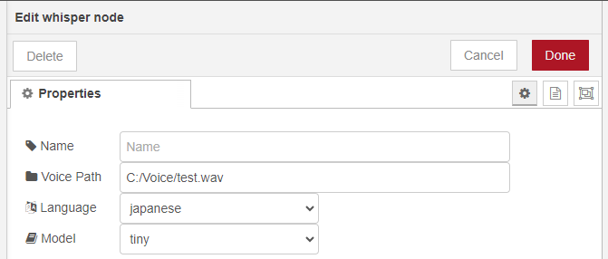

# node-red-contrib-whisper

Node for Whisper

## Overview

This node uses [OpenAI's Whisper](https://github.com/openai/whisper)  
<https://github.com/openai/whisper>

**Python is required** to run this node.  
When you install this node, it creates Python virtual environment and Whisper is installed.  

## How to use

Here is a sample flow.

In this node, there are three values that can be set in the edit dialog.  

- Voice Path: Path of the audio file
- Language: Selection of the language for transcription
- Model: Selection of the language model

I recommend using the absolute path for the audio file.  
  

Voice Path can also replace the value of msg.voicepath.  

## Test case

Windows 10  

- Node.js: v20.10.0
- npm: 9.1.3
- Python: 3.8.3
- pip: 24.0

## Others

If you find any errors, bugs, or improvements, please report them to the issue!  
In the examples folder, you will find a sample for creating a list of language models.  
You can use it to add language models.  
I plan to add more samples in the future.  
